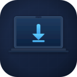

# MacSetup

A native macOS app for setting up a new Mac — browse, select, and install all your apps in one click.



## Features

- **Auto-detection** — scans `/Applications` and `brew list` on launch to grey out already-installed apps
- **Categorized checklist** — browse by Browsers, Development, AI & LLM, Productivity, Media, Utilities, CLI Tools, App Store, and Manual
- **One-click install** — runs `brew reinstall --cask` / `brew reinstall` for all selected apps sequentially
- **Live terminal output** — split-pane progress sheet streams real-time brew logs with color-coded output
- **Official website links** — every app row has a `↗` link to its official site
- **Homebrew onboarding** — prompts new users to install Homebrew before first use
- **Refresh** — re-scans installed status on demand (useful after manually deleting apps)

## App Catalog (29 apps)

| Category | Apps |
|---|---|
| Browsers | Dia, Arc, Brave, Chrome |
| Development | VS Code, iTerm2, Figma |
| AI & LLM | Ollama, Codex |
| Productivity | Notion, Notion Calendar, Notion Mail, Raycast, OneDrive |
| Media | IINA, Affinity Publisher 2 |
| Utilities | Stats, Surfshark, Webex, Citrix Workspace, Logi Options+, MonitorControl Lite |
| CLI Tools | git, gh, node, yabai |
| App Store | Xcode, Amphetamine, LINE, Wallpaper Play |
| Manual | Claude, Microsoft Word, Antigravity, cmux |

## Quick Install

1. Download **[MacSetup.dmg](MacSetup.dmg)**
2. Open the DMG and drag **MacSetup.app** into your Applications folder
3. Launch MacSetup from Applications or Spotlight
4. If prompted, install Homebrew first — the app will walk you through it
5. Select the apps you want, click **Install** — done

> **"MacSetup.app is damaged and can't be opened"**
> macOS quarantines apps downloaded from the internet that aren't notarized by Apple. To fix, run this in Terminal **after dragging to Applications**:
> ```zsh
> xattr -cr /Applications/MacSetup.app
> ```
> This removes the quarantine flag and the app will open normally. You only need to do this once.

## Requirements

- macOS 14 (Sonoma) or later
- [Homebrew](https://brew.sh) — the app will prompt you to install it on first launch if missing
- Xcode 15+ (to build from source)

## Build from Source

```zsh
# Install dependencies
brew install xcodegen

# Generate Xcode project
xcodegen generate

# Open in Xcode
open MacSetup.xcodeproj
```

Then press `⌘R` to build and run.

## Build a DMG

```zsh
./make_dmg.sh
```

Produces `MacSetup.dmg` in the project root — a standard drag-to-Applications installer.

## Adding Apps

Edit `MacSetup/Models/AppCatalog.swift` and add an `AppItem` entry:

```swift
AppItem(
    id: UUID(),
    name: "My App",
    category: .utilities,
    method: .brewCask(caskName: "my-app"),
    bundleName: "My App",          // .app name in /Applications (for installed detection)
    website: url("https://myapp.com")
)
```

Install methods: `.brewCask`, `.brewFormula`, `.appStore(url:)`, `.manual(url:)`.
